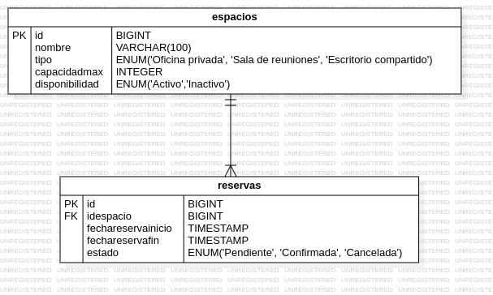

# Sistema Gestor de Reservas para Coworking

## Contexto del Problema

CoworkTech es una empresa emergente que ha creado una red de espacios de **coworking** en distintas ciudades. Estos espacios permiten a **profesionales independientes, startups y empresas** alquilar oficinas privadas, salas de reuniones o escritorios compartidos por horas o días.

### El problema

Actualmente, las reservas se gestionan de forma manual mediante llamadas y correos electrónicos, lo que genera confusión, sobrecargas de trabajo y errores en la asignación de espacios.

### La solución

Para mejorar este proceso, CoworkTech ha decidido modernizar su sistema con una **API REST** que permita:

- Consultar los espacios disponibles 
- Reservar espacios en función de la disponibilidad 
- Gestionar las reservas fácilmente 

Tu misión como **desarrollador backend** es construir esta API utilizando **Spring Boot** con **PostgreSQL**, asegurando un buen manejo de datos, validaciones y errores. 

---

## Especificaciones del sistema

###  Gestión de Espacios de Coworking

Se deben registrar distintos tipos de espacios:

- **Oficinas privadas**
- **Salas de reuniones**
- **Escritorios compartidos**

Cada espacio debe contener:

- **Nombre** (Ej: "Sala Azul", "Oficina 3A")
- **Tipo** (oficina privada, sala de reuniones, escritorio compartido)
- **Capacidad máxima**
- **Disponibilidad** (activo/inactivo)

#### Funcionalidades a desarrollar

- Registrar nuevos espacios
- Consultar la lista de espacios disponibles
- Modificar espacios existentes
- Eliminar espacios

---

### Reservas de Espacios

Los usuarios pueden reservar espacios disponibles. Cada reserva contiene:

- **ID del espacio reservado**
- **Fecha de la reserva**
- **Hora de inicio y fin**
- **Estado de la reserva:**
  - **Pendiente** (cuando se crea)
  - **Confirmada** (cuando es aceptada por el sistema)
  - **Cancelada** (cuando el usuario decide no asistir)

#### Reglas para las reservas

X No puede haber dos reservas en el mismo horario para el mismo espacio.
- Los escritorios compartidos pueden ser reservados sin restricciones.
- El usuario solo puede **modificar o cancelar** reservas con estado "Pendiente".

#### Funcionalidades a desarrollar

- Crear una nueva reserva
- Consultar todas las reservas activas
- Modificar una reserva
- Eliminar reservas

---

### API REST y Consumo de Datos

#### Espacios de coworking:

- Listar todos los espacios
- Filtrar por tipo o disponibilidad
- Crear, modificar y eliminar espacios

#### Reservas:

- Listar reservas activas
- Filtrar reservas por fecha y estado
- Crear, modificar y cancelar reservas

---

### Validación y Manejo de Errores

Se validan antes de almacenar:

- Fechas y horarios deben ser **coherentes**.
- No se pueden reservar espacios en el mismo horario si ya están ocupados.

#### ⚠ Excepciones personalizadas

Se ha implementado un **manejador centralizado de excepciones** con `@ControllerAdvice` para capturar errores y devolver **mensajes de error personalizados**.

---

### Documentación con Swagger

La API está documentada con **Swagger**, incluye:

- Descripción de cada endpoint
- Parámetros requeridos
- Posibles respuestas y códigos de error

---

### Persistencia de Datos con PostgreSQL

Base de datos relacional, PostgreSQL con Spring Data JPA.

#### Tablas requeridas:

- **Espacios** (con las características mencionadas)
- **Reservas** (con restricciones para evitar solapamientos)
---

## Tecnologías utilizadas

- **Java 17**
- **Spring Boot 3**
- **Spring Data JPA**
- **PostgreSQL**
- **Swagger**
- **Lombok**

---

## Instalación y ejecución

### Clonar el repositorio:

```bash
 git clone https://github.com/JavierEAcevedoN/Cowork-Tech-Examen
 cd Cowork-Tech-Examen
 code .
```

### Ejecutar el proyecto

### Acceder a Swagger

```
http://localhost:8081/swagger-ui.html
```

---

## Diagrama relacional de la base de datos



---

## Esquma de tablas creadas por medio de JPA

```sql
CREATE TABLE espacios (
    id SERIAL PRIMARY KEY,
    nombre VARCHAR(100) NOT NULL,
    tipo VARCHAR(50) CHECK (tipo IN ('OficinaPrivada', 'SalaReuniones', 'EscritorioCompartido'))),
    capacidad INT NOT NULL,
    disponibilidad CHECK (disponibilidad IN ('Activo', 'Inactivo')
);

CREATE TABLE reservas (
    id SERIAL PRIMARY KEY,
    idespacio INT REFERENCES espacios(id),
    fechareservainicio TIMESTAMP NOT NULL,
    fechareservafin TIMESTAMP NOT NULL,
    estado VARCHAR(20) CHECK (estado IN ('Pendiente', 'Confirmada', 'Cancelada'))
);
```

*(aquí inserciones de prueba.)*

---

## Lista de Endpoints con ejemplos de uso

Hacer úso de Thunder Client para importar las pruebas de endpoints por medio de `ThunderClientConfig.json`.